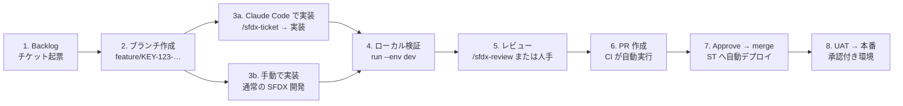

# sfdx-devops-kit

**YAML 1 枚でパイプライン全体を制御します。** 任意の Salesforce DX プロジェクトに導入するだけで、CI/CD・品質ゲート・AI レビュー・チケット単位の成果物記録が揃います。設定は
`sfdx-pipeline.config.yml` に集約され、ワークフローファイルを触る必要はありません。

[English README](README.md) ｜ [運用マニュアル](docs/OPERATIONS_MANUAL.ja.md) ｜ [パイプラインサンプル](docs/PIPELINE_SAMPLES.md) ｜ [設定リファレンス](docs/CONFIG_REFERENCE.md)

```bash
npx sfdx-devops-kit init .      # パイプライン・CI・Claude スキル・ナレッジを配置
npx sfdx-devops-kit validate    # 設定検証と必要な GitHub Secrets の一覧
npx sfdx-devops-kit plan        # CI が何を実行するか（と理由）を表示
npx sfdx-devops-kit run         # 同じゲートでローカル実行
```

Sandbox の追加、カバレッジ閾値の変更、特定ステージの停止は **1 行の編集**で完結します。GitHub Actions は本キットが設定から導出した plan を読むため、二重管理が発生しません。

---

## 設計の狙い

Salesforce のパイプラインは、閾値が埋め込まれ org 別名がハードコードされた 400 行のワークフローになりがちで、作った本人以外が変更できなくなります。本キットでは設定ファイルが 3 つの利用者にとっての単一の真実です。

| 利用者             | 設定の読み方                                                                  |
| ------------------ | ----------------------------------------------------------------------------- |
| GitHub Actions     | `plan --json` が出す `enabled` マップで各ステップを制御                       |
| ローカル CLI       | `run` が同じ plan を同じゲートで実行                                          |
| Claude Code スキル | `/sfdx-review`・`/sfdx-deliverables` が閾値・ルール・Backlog マッピングを参照 |

## 提供機能

- **理由の分かる品質ゲート** — ESLint / Prettier / Salesforce Code Analyzer（v5・legacy 両対応）／検証デプロイ／Apex カバレッジ／結合・E2E。終了コードだけに頼らず、設定から導いたゲートで判定します。
- **チケット単位のメタデータ成果物記録** — git diff から「そのチケットが納品した Salesforce コンポーネント」を生成し、その変更だけをデプロイできる `package.xml` も出力します。
- **自社ルールに従う AI レビュー** — `/sfdx-review` が差分を `knowledge/sfdx/coding-rules.md` と突き合わせ、指摘と成果物一覧を Backlog チケットに投稿。クリティカル指摘が無い場合のみステータスを進めます。
- **rtk-sf をデフォルト統合** — MCP 経由の圧縮メタデータ仕様、ファイル全文ではなく Apex スケルトン、システム設計書の自動生成。未導入でも**警告のみでビルドは失敗しません**。
- **リポジトリに資格情報を置かない** — Backlog へは Backlog MCP サーバー経由。org 認証は `validate` が示す GitHub Secrets から取得します。

---

## 導入

必要環境：Node 18 以上、Salesforce CLI、（Java 製解析エンジン PMD/CPD/SFGE を使う場合）JDK 11 以上。

```bash
# 既存の SFDX プロジェクトに追加
npx sfdx-devops-kit init .

# 新規プロジェクトとパイプラインを同時に作成
git clone https://github.com/furuCRM-Inc/sfdx-devops-kit
./sfdx-devops-kit/scripts/setup-project.sh ./my-project --name my-project
```

`init` は**既存ファイルを上書きしません**（`--force` 指定時のみ）。`package.json` は**マージ**されるため、既存のスクリプトやバージョン固定は保持されます。`--dry-run` で事前確認できます。

配置されるファイル:

```text
sfdx-pipeline.config.yml           単一の真実（設定）
.github/workflows/sfdx-ci-cd.yml   plan → quality → validate → deploy → deliverables
.github/pull_request_template.md   成果物セクション付き PR テンプレート
.mcp.json                          Backlog MCP + rtk-sf 登録（資格情報は含まない）
.claude/skills/sfdx-ticket.md      /sfdx-ticket
.claude/skills/sfdx-review.md      /sfdx-review
.claude/skills/sfdx-deliverables.md  /sfdx-deliverables
.claude/rules/salesforce-governance.md
knowledge/sfdx/coding-rules.md     レビューが強制するルール（ここを編集）
knowledge/sfdx/review-checklist.md
playwright.config.js, tests/e2e/   E2E 雛形
.forceignore
```

---

## 設定

```yaml
version: "1.0"
project_name: "my-project"

environments:
  st:
    alias: "STSandbox"
    type: "sandbox"
    is_test_target: true # CI の検証デプロイと E2E 実行先
  prod:
    alias: "Production"
    type: "production"
    deploy_manifest: "manifest/package.xml"

pipeline_settings:
  code_analyzer:
    enabled: true
    engine: "code-analyzer" # legacy プラグインなら "scanner"
    rule_selector: "Recommended"
    severity_threshold: 3 # この深刻度以上で失敗（1=Critical … 5=Info）
  unit_test:
    enabled: true
    test_level: "RunLocalTests"
    coverage_threshold: 75
  e2e_test:
    enabled: true
    tool: "playwright"

ai_assist:
  rtk_sf:
    enabled: true # 既定で有効
    required: false # 未導入なら該当ステージをスキップ（失敗させない）

backlog_integration:
  project_key: "PROJECT_KEY"
  status_mapping:
    review_ready: "処理済み"
```

編集後は必ず `validate` を実行してください。問題のある YAML パス（`pipeline_settings.unit_test.test_level` など）を示し、作成すべき Secrets を出力します。

```text
SF_ST_AUTH_URL           → STSandbox (sandbox)
SF_PROD_AUTH_URL         → Production (production)
```

### CLI が後で拒否する設定を、事前に検出します

- `sf project deploy start` は `--manifest` / `--source-dir` / `--metadata` を**併用できません**。1 環境に 2 つ書いた時点でエラーにします（デプロイ失敗を待ちません）。
- `RunSpecifiedTests` で `tests` 未指定はエラー。
- `is_test_target` が 2 つはエラー、0 個は警告。
- カバレッジゲート有効時の `NoTestRun` は「カバレッジを測定できない」と警告。

---

## ステージ

以下の順に実行され、個別に無効化できます。

| ステージ           | ゲート                                                                                           |
| ------------------ | ------------------------------------------------------------------------------------------------ |
| `lint`             | ESLint の終了状態                                                                                |
| `prettier`         | フォーマット検査                                                                                 |
| `code_analyzer`    | `severity_threshold` 以下の違反が 0 件                                                           |
| `validate_deploy`  | dry-run デプロイが検証を通過                                                                     |
| `unit_test`        | org カバレッジ ≥ `coverage_threshold`（検証デプロイの結果を読むため Apex テストは 1 回だけ実行） |
| `deploy`           | 本デプロイ成功（CI では PR 以外のイベントのみ実行）                                              |
| `integration_test` | Newman または任意コマンド                                                                        |
| `e2e_test`         | Playwright または任意コマンド                                                                    |
| `documentation`    | rtk-sf がシステム設計書を再生成                                                                  |

```bash
npx sfdx-devops-kit run --env uat            # 環境指定
npx sfdx-devops-kit run code_analyzer        # 単一ステージ
npx sfdx-devops-kit run --skip e2e_test      # 一部除外
npx sfdx-devops-kit run --dry-run            # コマンド表示のみ
```

ゲートは**本当の失敗理由**を返します。テストが全件成功していても Salesforce 側のカバレッジ要件で失敗することがあり、その場合は org のメッセージ（日本語ローカライズも含む）をそのまま表示します。解析エンジンが起動できない場合は「コード違反」ではなく**環境問題**として報告します。

---

## チケット単位の成果物記録

```bash
npx sfdx-devops-kit deliverables --base origin/develop --format md
npx sfdx-devops-kit deliverables --base origin/develop --format package-xml \
  --out manifest/ticket-package.xml
```

```markdown
## 成果物（メタデータ） / Delivered metadata

- 課題キー: DEMO-42
- コンポーネント数: 2

| 種別 (Type) | API 名 (Name)          | 変更 (Change) |
| ----------- | ---------------------- | ------------- |
| ApexClass   | `AccountNameFormatter` | added         |
| CustomField | `Order__c.Status__c`   | modified      |
```

ファイルパスをコンポーネント単位に正規化します。LWC バンドルは 1 件、`-meta.xml` は別件に数えず、項目は `Object.Field` 表記。`sfdx-project.json` のパッケージディレクトリ配下のみをメタデータと見なすため、`.github/workflows/` の CI 定義が Salesforce の Workflow と誤認されることはありません。CI は全 PR にこれを添付し、`/sfdx-review` がチケットへ投稿します。

---

## Claude Code 連携

| コマンド             | 動作                                                                                                                              |
| -------------------- | --------------------------------------------------------------------------------------------------------------------------------- |
| `/sfdx-review`       | 差分を自社ルールで review し、**指摘と成果物一覧**を Backlog チケットへ投稿。クリティカル指摘が無い場合のみ `review_ready` へ遷移 |
| `/sfdx-deliverables` | チケットの納品メタデータを記録（チケット単位 `package.xml` も任意添付）                                                           |

いずれも **Backlog MCP サーバー**経由でチケットを操作するため、Backlog の資格情報をリポジトリに置きません。

### rtk-sf（既定で統合）

[rtk-sf](https://github.com/furuCRM-Inc/rtk-sf) は MCP 経由で圧縮メタデータ仕様を提供します。レビューはファイル全文ではなくクラスのスケルトンを読み、`documentation` ステージは機能マトリクス・シーケンス図・ERD などを生成します。

```bash
pip install "git+https://github.com/furuCRM-Inc/rtk-sf.git@v0.10.0"
claude mcp add rtk-sf -- python3 -m rtk_sf serve
python3 -m rtk_sf index
```

`setup-project.sh` は rtk-sf が存在すれば上記を自動実行します。未導入の場合は `documentation` ステージのみスキップし、他は通常動作します（必須にするには `ai_assist.rtk_sf.required: true`）。

---

## 使用フロー（チケット → 実装 → PR → レビュー → リリース）

詳細な手順・実出力例は [運用マニュアル](docs/OPERATIONS_MANUAL.ja.md)、設定の実例は
[パイプラインサンプル集](docs/PIPELINE_SAMPLES.md) を参照してください。



**AI を使う場合も使わない場合も、パイプラインとゲートは同一です。** Claude Code は
実装とレビューを速くしますが、品質ゲート（Code Analyzer・カバレッジ・検証デプロイ）は
CLI と CI が担保します。

| ステップ    | AI 支援あり                                                     | 手動のみ                                  |
| ----------- | --------------------------------------------------------------- | ----------------------------------------- |
| 1. 起票     | `/sfdx-ticket` が受入条件つきで `add_issue`                     | Backlog 画面で起票                        |
| 2. 着手     | `/sfdx-ticket` が `get_issue` → 計画、`update_issue` で処理中へ | ブランチ作成、ステータス変更              |
| 3. 実装     | rtk-sf の圧縮仕様で既存実装を把握 → Apex/LWC＋テスト生成        | 通常の SFDX 開発（VS Code 等）            |
| 4. 検証     | `npx sfdx-devops-kit run --env dev`                             | 同一コマンド                              |
| 5. レビュー | `/sfdx-review` が指摘＋成果物＋PR リンクをチケットへ投稿        | `deliverables` の出力を手でチケットに貼る |
| 6. PR       | `gh pr create`（本文に成果物一覧）                              | GitHub 画面で作成                         |
| 7〜8        | 共通（CI → Approve → ST → UAT → 本番）                          | 共通                                      |

手動運用でもチケットに成果物を残せます:

```bash
npx sfdx-devops-kit deliverables --base origin/develop --format md   # コメント本文
npx sfdx-devops-kit backlog --phase review_ready                     # 投稿すべき MCP 呼び出し
```

## 運用

役割ごとの詳細手順は [運用マニュアル](docs/OPERATIONS_MANUAL.ja.md) を参照してください。

| 役割       | 作業                                                                                       |
| ---------- | ------------------------------------------------------------------------------------------ |
| 開発者     | チケット受領 → Claude Code で実装 → 個人 Dev Sandbox で確認 → `/sfdx-review` → PR 作成     |
| レビュアー | CI 結果と AI レビューを確認 → Approve → `develop` へマージ                                 |
| DevOps     | `sfdx-pipeline.config.yml` の編集で Sandbox 追加やゲート調整、`knowledge/sfdx/` の継続更新 |

---

## トラブルシューティング

| 症状                                              | 原因と対処                                                                                             |
| ------------------------------------------------- | ------------------------------------------------------------------------------------------------------ |
| `Secret SF_ST_AUTH_URL is not set`                | `validate` が示す Secret を登録。値は `sf org display --target-org <alias> --verbose` の Sfdx Auth Url |
| `UninstantiableEngineError`                       | JDK 不在。Java 11+ を導入、または `rule_selector: eslint`                                              |
| `Coverage gate cannot be evaluated`               | デプロイが Apex テストを実行していない（`test_level` が `NoTestRun`）                                  |
| `cannot also be provided when using --source-dir` | 1 環境にデプロイセレクタが 2 つ。`validate` で検出可能                                                 |
| `deliverables` が空                               | base ref がローカルに無い（`git fetch origin`）                                                        |

---

## 開発

```bash
npm install
npm test        # node:test（テストフレームワーク依存なし）
node bin/cli.mjs --help
```

実行時依存は `js-yaml` のみです。

## ライセンス

MIT © furuCRM Inc.
