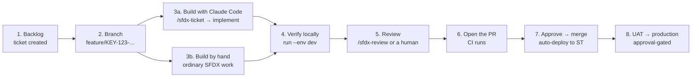

# sfdx-devops-kit

**One YAML file drives the whole pipeline.** Drop this kit into any Salesforce DX
project and get CI/CD, quality gates, AI-assisted review and per-ticket metadata
records — configured in `sfdx-pipeline.config.yml`, not scattered across workflow
files.

[日本語版 README](README.ja.md) · [Operations manual](docs/OPERATIONS_MANUAL.md) · [Pipeline samples](docs/PIPELINE_SAMPLES.md) · [Configuration reference](docs/CONFIG_REFERENCE.md)

```bash
npx sfdx-devops-kit init .      # scaffold pipeline, CI, Claude skills, knowledge base
npx sfdx-devops-kit validate    # check the config, list the GitHub Secrets you need
npx sfdx-devops-kit plan        # see exactly what CI will run, and why
npx sfdx-devops-kit run         # run it locally, with the same gates
```

Adding a sandbox, changing a coverage threshold or turning off a stage is a
one-line edit. The GitHub Actions workflow reads the plan this kit derives from
the config, so nothing has to be edited twice.

---

## Why this exists

A Salesforce pipeline usually ends up as a 400-line workflow file that only its
author can change: thresholds are inline, org aliases are hardcoded, and
disabling E2E for one release means editing YAML that also controls deployment.

Here, the config is the single source of truth for three consumers:

| Consumer           | How it reads the config                                                            |
| ------------------ | ---------------------------------------------------------------------------------- |
| GitHub Actions     | `plan --json` emits an `enabled` map; each step is gated by it                     |
| Local CLI          | `run` executes the same plan, with the same gates                                  |
| Claude Code skills | `/sfdx-review` and `/sfdx-deliverables` read thresholds, rules and Backlog mapping |

## What you get

- **Quality gates that fail for the right reason.** ESLint, Prettier, Salesforce
  Code Analyzer (v5 or legacy), validation deploy, Apex coverage, integration and
  E2E — each with a gate derived from the config, not from an exit code alone.
- **Per-ticket metadata records.** `deliverables` turns a git diff into the
  Salesforce components a ticket shipped, plus a `package.xml` that deploys
  exactly that change.
- **AI review that follows your rules.** `/sfdx-review` checks the diff against
  `knowledge/sfdx/coding-rules.md`, posts findings and the delivered-metadata
  list to the Backlog ticket, and moves the ticket only when nothing critical is
  open.
- **rtk-sf integrated by default.** Compressed metadata specs over MCP, Apex
  skeletons instead of whole files, and generated system documentation. Missing
  rtk-sf is a warning, never a build failure.
- **No credentials in the repo.** Backlog access happens through your Backlog MCP
  server; org auth comes from GitHub Secrets named by `validate`.

---

## Install

Requires Node 18+, the Salesforce CLI, and a JDK 11+ if you use the Java-based
analyzer engines (PMD/CPD/SFGE).

```bash
# In an existing SFDX project
npx sfdx-devops-kit init .

# Or scaffold a new project and the pipeline together
git clone https://github.com/furuCRM-Inc/sfdx-devops-kit
./sfdx-devops-kit/scripts/setup-project.sh ./my-project --name my-project
```

`init` never overwrites: existing files are kept unless you pass `--force`, and
`package.json` is **merged** (your pins and scripts survive). `--dry-run` shows
what would change.

Installed files:

```text
sfdx-pipeline.config.yml           the single source of truth
.github/workflows/sfdx-ci-cd.yml   plan → quality → validate → deploy → deliverables
.github/pull_request_template.md   includes a delivered-metadata section
.mcp.json                          Backlog MCP + rtk-sf registration (no credentials)
.claude/skills/sfdx-ticket.md      /sfdx-ticket
.claude/skills/sfdx-review.md      /sfdx-review
.claude/skills/sfdx-deliverables.md  /sfdx-deliverables
.claude/rules/salesforce-governance.md
knowledge/sfdx/coding-rules.md     the rules the review enforces — edit these
knowledge/sfdx/review-checklist.md
playwright.config.js, tests/e2e/   E2E scaffolding
.forceignore
```

---

## Configure

```yaml
version: "1.0"
project_name: "my-project"

environments:
  st:
    alias: "STSandbox"
    type: "sandbox"
    is_test_target: true # CI validates and runs E2E here
  prod:
    alias: "Production"
    type: "production"
    deploy_manifest: "manifest/package.xml"

pipeline_settings:
  code_analyzer:
    enabled: true
    engine: "code-analyzer" # or "scanner" for the legacy plugin
    rule_selector: "Recommended"
    severity_threshold: 3 # fail at this severity or worse (1=Critical … 5=Info)
  unit_test:
    enabled: true
    test_level: "RunLocalTests"
    coverage_threshold: 75
  e2e_test:
    enabled: true
    tool: "playwright"

ai_assist:
  rtk_sf:
    enabled: true # on by default
    required: false # missing rtk-sf skips its stages, never fails

backlog_integration:
  project_key: "PROJECT_KEY"
  status_mapping:
    review_ready: "処理済み"
```

Run `validate` after every edit. It reports the YAML path of any problem
(`pipeline_settings.unit_test.test_level`) and prints the secrets to create:

```text
SF_ST_AUTH_URL           → STSandbox (sandbox)
SF_PROD_AUTH_URL         → Production (production)
```

### Validation catches what the CLI would reject later

- `--manifest`, `--source-dir` and `--metadata` cannot be combined on
  `sf project deploy start`; declaring two selectors for one environment is an
  error here rather than a failed deployment.
- `RunSpecifiedTests` without a `tests` list is an error.
- Two environments marked `is_test_target` is an error; none is a warning.
- `NoTestRun` with the coverage gate enabled warns that coverage cannot be measured.

---

## Stages

Run in this order; each can be disabled independently.

| Stage              | Gate                                                                                    |
| ------------------ | --------------------------------------------------------------------------------------- |
| `lint`             | ESLint exit status                                                                      |
| `prettier`         | formatting check                                                                        |
| `code_analyzer`    | no violation at or below `severity_threshold`                                           |
| `validate_deploy`  | dry-run deployment validates                                                            |
| `unit_test`        | org coverage ≥ `coverage_threshold` (reads the validation deploy — Apex tests run once) |
| `deploy`           | real deployment succeeds (CI runs this only outside pull requests)                      |
| `integration_test` | Newman or your own command                                                              |
| `e2e_test`         | Playwright or your own command                                                          |
| `documentation`    | rtk-sf regenerates the system document set                                              |

```bash
npx sfdx-devops-kit run --env uat            # one environment
npx sfdx-devops-kit run code_analyzer        # one stage
npx sfdx-devops-kit run --skip e2e_test      # everything but one
npx sfdx-devops-kit run --dry-run            # print commands, execute nothing
```

Gates report the real reason. A deployment whose tests all pass can still fail
Salesforce's own coverage requirement — the kit surfaces the org's message
(including localized ones) instead of a bare "Failed". An analyzer that cannot
start its engines is reported as an infrastructure problem, not as code findings.

---

## Per-ticket metadata records

```bash
npx sfdx-devops-kit deliverables --base origin/develop --format md
npx sfdx-devops-kit deliverables --base origin/develop --format package-xml \
  --out manifest/ticket-package.xml
```

```markdown
## 成果物（メタデータ） / Delivered metadata

- 課題キー: DEMO-42
- コンポーネント数: 2

| 種別 (Type) | API 名 (Name)          | 変更 (Change) |
| ----------- | ---------------------- | ------------- |
| ApexClass   | `AccountNameFormatter` | added         |
| CustomField | `Order__c.Status__c`   | modified      |
```

File paths become components: an LWC bundle is one entry, a `-meta.xml`
companion is not a second one, and a field is reported as `Object.Field`. Only
paths under a package directory from `sfdx-project.json` count as metadata, so a
GitHub workflow in `.github/workflows/` is never mistaken for a Salesforce
Workflow. CI attaches this to every pull request; `/sfdx-review` posts it to the
ticket.

---

## Claude Code integration

| Command              | What it does                                                                                                                                                                       |
| -------------------- | ---------------------------------------------------------------------------------------------------------------------------------------------------------------------------------- |
| `/sfdx-review`       | Reviews the diff against your rules, posts findings **and** the delivered metadata to the Backlog ticket, then moves the ticket to `review_ready` only if nothing critical is open |
| `/sfdx-deliverables` | Records what a ticket shipped, with an optional per-ticket `package.xml`                                                                                                           |

`/sfdx-ticket` creates a ticket and turns an assigned one into a plan.

All three call the **Backlog MCP server** ([nulab/backlog-mcp-server](https://github.com/nulab/backlog-mcp-server)),
which `init` registers in `.mcp.json`. Credentials stay in your environment:

```bash
export BACKLOG_DOMAIN=your-space.backlog.com
export BACKLOG_API_KEY=...      # Backlog → personal settings → API
```

`npx sfdx-devops-kit backlog` prints the exact calls for the current branch:

```text
MCP server: backlog
ticket:     PROJ-142
status:     review_ready → "処理済み"  (statusId 3, standard)

calls to make:
  get_issue({"issueKey":"PROJ-142"})
  add_issue_comment({"issueKey":"PROJ-142","content":"<45 line comment>"})
  update_issue({"issueKey":"PROJ-142","statusId":3})
```

The server exposes no status-listing tool, so status names resolve through
Backlog's built-in ids (1 未対応 / 2 処理中 / 3 処理済み / 4 完了). A project with
custom statuses lists them in `backlog_integration.status_ids`; an unknown status
is reported as unresolved rather than guessed, because a wrong id moves the ticket
to an unrelated state.

### rtk-sf (default)

[rtk-sf](https://github.com/furuCRM-Inc/rtk-sf) serves compressed metadata specs
over MCP, so the review reads a class skeleton rather than a whole file, and the
`documentation` stage generates a function matrix, sequence diagrams, an ERD and
more.

```bash
pip install "git+https://github.com/furuCRM-Inc/rtk-sf.git@v0.10.0"
claude mcp add rtk-sf -- python3 -m rtk_sf serve
python3 -m rtk_sf index
```

`setup-project.sh` does this for you when rtk-sf is present. Without it, the
`documentation` stage is skipped with a hint and everything else runs normally —
set `ai_assist.rtk_sf.required: true` to make it mandatory instead.

---

## Team workflow

---

## Usage flow (ticket → build → PR → review → release)

Step-by-step commands and real output are in the
[operations manual](docs/OPERATIONS_MANUAL.md); ready-made configurations are in
[pipeline samples](docs/PIPELINE_SAMPLES.md).



**The pipeline and its gates are the same with or without AI.** Claude Code makes
building and reviewing faster; the guarantees come from the CLI and CI.

| Step               | With AI assistance                                                        | By hand                                     |
| ------------------ | ------------------------------------------------------------------------- | ------------------------------------------- |
| 1. File the ticket | `/sfdx-ticket` calls `add_issue` with acceptance criteria                 | Create it in Backlog                        |
| 2. Start           | `/sfdx-ticket` reads it, plans, moves the status                          | Branch and set the status                   |
| 3. Build           | rtk-sf specs to survey, then Apex/LWC plus tests                          | Ordinary SFDX development                   |
| 4. Verify          | `npx sfdx-devops-kit run --env dev`                                       | The same command                            |
| 5. Review          | `/sfdx-review` posts findings, deliverables and the PR link to the ticket | Paste `deliverables` output into the ticket |
| 6. PR              | `gh pr create` with the deliverables in the body                          | Open it on GitHub                           |
| 7–8                | Identical (CI → approve → ST → UAT → production)                          | Identical                                   |

A manual team still gets the ticket record:

```bash
npx sfdx-devops-kit deliverables --base origin/develop --format md   # the comment body
npx sfdx-devops-kit backlog --phase review_ready                     # the MCP calls to make
```

See the [operations manual](docs/OPERATIONS_MANUAL.md) for worked examples of
every step, including release and rollback.

| Role      | Work                                                                                                |
| --------- | --------------------------------------------------------------------------------------------------- |
| Developer | Take the ticket → build with Claude Code → verify in a dev sandbox → `/sfdx-review` → open the PR   |
| Reviewer  | Read CI results and the AI review comment, approve, merge to `develop`                              |
| DevOps    | Change `sfdx-pipeline.config.yml` to add a sandbox or adjust a gate; keep `knowledge/sfdx/` current |

---

## Troubleshooting

| Symptom                                           | Cause                                                                                               |
| ------------------------------------------------- | --------------------------------------------------------------------------------------------------- |
| `Secret SF_ST_AUTH_URL is not set`                | Add the secret `validate` names; get the value from `sf org display --target-org <alias> --verbose` |
| Analyzer reports `UninstantiableEngineError`      | No JDK. Install Java 11+, or use `rule_selector: eslint`                                            |
| `Coverage gate cannot be evaluated`               | The deploy ran no Apex tests — `test_level` is `NoTestRun`                                          |
| `cannot also be provided when using --source-dir` | Two deployment selectors on one environment; `validate` catches this                                |
| `deliverables` lists nothing                      | The base ref is missing locally — `git fetch origin`                                                |

---

## Development

```bash
npm install
npm test        # node:test, no test framework dependency
node bin/cli.mjs --help
```

`js-yaml` is the only runtime dependency.

## License

MIT © furuCRM Inc.
