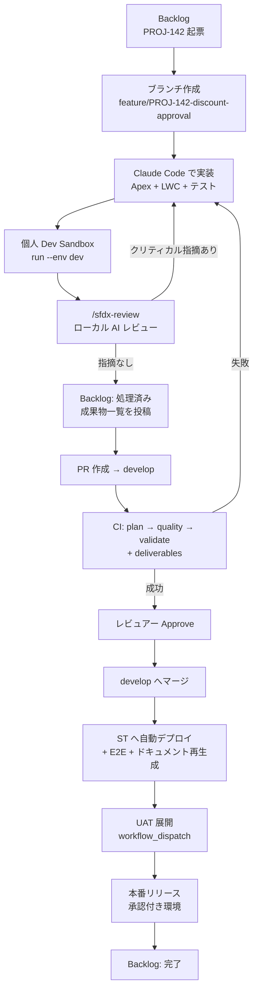

# 運用マニュアル

チケット作成からリリースまでの流れを、実際のコマンドと出力例で示します。例は
架空プロジェクト `PROJ`（商談の割引申請機能）を題材にしています。

- [全体像](#全体像)
- [役割と責務](#役割と責務)
- [事前準備（初回のみ）](#事前準備初回のみ)
- [Step 1: チケット作成](#step-1-チケット作成)
- [Step 2: 着手](#step-2-着手)
- [Step 3: 実装](#step-3-実装)
- [Step 4: 個人 Dev Sandbox で確認](#step-4-個人-dev-sandbox-で確認)
- [Step 5: ローカル AI レビュー](#step-5-ローカル-ai-レビュー)
- [Step 6: PR 作成と CI](#step-6-pr-作成と-ci)
- [Step 7: レビューとマージ](#step-7-レビューとマージ)
- [Step 8: ST 環境への自動デプロイ](#step-8-st-環境への自動デプロイ)
- [Step 9: UAT 展開](#step-9-uat-展開)
- [Step 10: 本番リリース](#step-10-本番リリース)
- [例外フロー](#例外フロー)
- [定期運用](#定期運用)
- [早見表](#早見表)

---

## 全体像



ステータスは `sfdx-pipeline.config.yml` の `backlog_integration.status_mapping`
に従います（既定：`処理中` → `処理済み` → `完了`）。

---

## 役割と責務

| 役割                | 担当作業                                                       | 主なツール                                 |
| ------------------- | -------------------------------------------------------------- | ------------------------------------------ |
| 開発者              | チケット受領、実装、Dev Sandbox 確認、`/sfdx-review`、PR 作成  | Claude Code、Dev Sandbox、Backlog MCP、git |
| レビュアー / リード | CI 結果と AI レビューの確認、Approve、`develop` へマージ       | GitHub PR、GitHub Actions                  |
| DevOps / 管理者     | 設定変更（Sandbox 追加・閾値調整）、ナレッジ更新、リリース実行 | `sfdx-pipeline.config.yml`、GitHub Secrets |

境界線：**設定で変えられることは設定で変える**。ワークフロー YAML を編集する
必要が出たら、それは設定項目が足りていないサインです（Issue を立ててください）。

---

## 事前準備（初回のみ）

### 1. パイプラインの導入

```bash
cd my-sfdx-project
npx sfdx-devops-kit init .
npm install
```

### 2. 設定を自社環境に合わせる

`sfdx-pipeline.config.yml` の org 別名、閾値、Backlog プロジェクトキーを編集：

```yaml
project_name: "proj-crm"

environments:
  dev:
    alias: "DevSandbox"
    type: "sandbox"
  st:
    alias: "STSandbox"
    type: "sandbox"
    is_test_target: true
  uat:
    alias: "UATSandbox"
    type: "sandbox"
  prod:
    alias: "Production"
    type: "production"
    deploy_manifest: "manifest/package.xml"

backlog_integration:
  project_key: "PROJ"
```

### 3. 検証と Secrets 登録

```bash
$ npx sfdx-devops-kit validate
config: sfdx-pipeline.config.yml
  ✔ valid — 4 environment(s)

Required GitHub Secrets:
  SF_DEV_AUTH_URL          → DevSandbox (sandbox)
  SF_ST_AUTH_URL           → STSandbox (sandbox)
  SF_UAT_AUTH_URL          → UATSandbox (sandbox)
  SF_PROD_AUTH_URL         → Production (production)
```

各 org の認証 URL を取得して GitHub Secrets に登録します。

```bash
sf org display --target-org STSandbox --verbose | grep "Sfdx Auth Url"
# → force://PlatformCLI::<REDACTED>@<your-org>.my.salesforce.com
gh secret set SF_ST_AUTH_URL   # paste the value when prompted, do not put it in shell history
```

> **注意**：認証 URL はパスワード同等です。コミット・チケット・ログ・生成
> ドキュメントに絶対に残さないでください。

### 4. Claude Code と rtk-sf

```bash
pip install "git+https://github.com/furuCRM-Inc/rtk-sf.git@v0.10.0"
claude mcp add rtk-sf -- python3 -m rtk_sf serve
python3 -m rtk_sf index
npx sfdx-devops-kit doctor   # 環境の健全性チェック
```

Backlog MCP サーバーも Claude Code に登録しておきます（チケット参照・コメント
投稿・ステータス更新に使用）。

### 5. 本番デプロイに承認を付ける（推奨）

GitHub の Settings → Environments で `Production` 環境を作り、Required
reviewers を設定します。生成済みワークフローの `deploy` ジョブは
`environment: ${{ needs.plan.outputs.environment }}` を宣言しているため、承認
なしに本番へ流れません。

---

## Step 1: チケット作成

Backlog に起票します。**課題キーがそのままブランチ名に入る**ため、キーは必ず
確認してください（例：`PROJ-142`）。

チケット記載例：

```text
件名: 商談の割引申請（30% 超は承認必須）

背景:
  現在 30% を超える割引が承認なしで確定できてしまう。

受入条件:
  - 商談画面から割引率を申請できる
  - 30% を超える申請は承認プロセスに回る
  - 30% 以下は即時反映される
  - 承認待ちの商談は「確定」に遷移できない

影響範囲（想定）:
  Opportunity（項目追加）、Apex コントローラ、LWC、承認プロセス
```

担当者は自分をアサインし、ステータスを `処理中` にします。

---

## Step 2: 着手

### ブランチを作る

命名規則：`feature/<課題キー>-<英小文字の要約>`

```bash
git switch develop
git pull
git switch -c feature/PROJ-142-discount-approval
```

キーが正しく解決できるか、その場で確認できます：

```bash
$ npx sfdx-devops-kit ticket
branch: feature/PROJ-142-discount-approval
ticket: PROJ-142
status mapping:
  in_progress    → 処理中
  review_ready   → 処理済み
  closed         → 完了
```

`ticket: (unresolved)` と出る場合はブランチ名か `project_key` を見直します。

### 既存実装を調べる（rtk-sf 経由）

Claude Code へそのまま依頼します。

```text
PROJ-142 に着手します。Opportunity の割引に関わる既存実装を調べてください。
```

エージェントは rtk-sf の MCP ツールを使い、ファイル全文ではなく圧縮仕様で
把握します（`search_codebase` → `query_compressed_spec` → `get_relations` →
`get_object_schema`）。トークンを節約しつつ、影響範囲の見落としを防げます。

---

## Step 3: 実装

Claude Code への依頼例：

```text
Opportunity に Discount__c（Percent）と Discount_Status__c（Picklist: 申請中/承認済/却下）を
追加し、OpportunityDiscountController.requestDiscount(Id oppId, Decimal rate) を作成してください。
- 30% 超は承認プロセスへ、30% 以下は即時反映
- knowledge/sfdx/coding-rules.md に従うこと（ユーザーモード DML、ID ハードコード禁止）
- テストクラスも同時に作成（正常系・境界値 30%・異常系・バルク）
```

守るべきルールは `knowledge/sfdx/coding-rules.md` にあり、レビューも同じ
ファイルを参照します。ルールを変えたいときはコードではなくこのファイルを
変更してください。

ローカルの静的チェックはこの時点で回せます：

```bash
npx sfdx-devops-kit run lint prettier
```

---

## Step 4: 個人 Dev Sandbox で確認

まず何が実行されるかを確認（org には触りません）：

```bash
$ npx sfdx-devops-kit run --env dev --dry-run
▶ validate_deploy: Validation deploy to DevSandbox (dry run)
  $ sf project deploy start --json --target-org DevSandbox --test-level RunLocalTests --dry-run --wait 60
▶ unit_test: Apex unit tests and coverage gate
    gate: org-wide coverage must reach 75%
```

問題なければ実行：

```bash
$ npx sfdx-devops-kit run --env dev --skip e2e_test
▶ code_analyzer: Salesforce Code Analyzer
  ✔ No violations at severity <= 3 (2 total finding(s))
▶ validate_deploy: Validation deploy to DevSandbox (dry run)
  ✔ Succeeded: 6 component(s); coverage 87%
▶ unit_test: Apex unit tests and coverage gate
  ✔ Coverage 87% meets the 75% threshold
▶ deploy: Deploy to DevSandbox
  ✔ Succeeded: 6 component(s); coverage 87%

✔ pipeline passed — 4/4 stage(s) passed, coverage 87%
```

Salesforce 画面で実際の挙動（承認プロセスへの遷移など）を確認します。

---

## Step 5: ローカル AI レビュー

```text
/sfdx-review
```

出力例：

```text
レビュー結果 — PROJ-142（feature/PROJ-142-discount-approval）

critical: 0
major: 1
  - force-app/main/default/classes/OpportunityDiscountController.cls:48
    更新系メソッドに CRUD/FLS の強制がありません。`update as user` か
    stripInaccessible を使ってください（coding-rules.md 2）
minor: 1
  - OpportunityDiscountControllerTest.cls:72
    境界値 30% ちょうどのケースが未カバー

成果物: 6 コンポーネント（CustomField 2 / ApexClass 2 / LightningComponentBundle 1 / Flow 1）
Backlog: PROJ-142 にコメントを投稿しました。critical が 0 件のため
         ステータスを「処理済み」に更新しました。
```

Backlog に投稿されるコメント（成果物一覧を含む）：

```markdown
## レビュー結果

- critical: 0 / major: 1 / minor: 1
- major: OpportunityDiscountController.cls:48 CRUD/FLS の強制が不足

## 成果物（メタデータ） / Delivered metadata

- 課題キー: PROJ-142
- ブランチ: `feature/PROJ-142-discount-approval`
- PR: https://github.com/your-org/your-repo/pull/128 （open）
- コンポーネント数: 6

| 種別 (Type)              | API 名 (Name)                       | 変更 (Change) |
| ------------------------ | ----------------------------------- | ------------- |
| ApexClass                | `OpportunityDiscountController`     | added         |
| ApexClass                | `OpportunityDiscountControllerTest` | added         |
| CustomField              | `Opportunity.Discount__c`           | added         |
| CustomField              | `Opportunity.Discount_Status__c`    | added         |
| Flow                     | `Discount_Approval`                 | added         |
| LightningComponentBundle | `discountRequest`                   | added         |

**種別ごとの件数:** ApexClass 2 / CustomField 2 / Flow 1 / LightningComponentBundle 1
```

`critical` が 1 件でもあればステータスは進みません。指摘を直して再度
`/sfdx-review` を実行します。

**PR リンクについて**: コメントには PR の URL が自動で入ります（`gh pr view` で
解決）。PR 作成前は GitHub の比較リンクにフォールバックし「未作成（比較リンク）」
と明示されます。チケットに実 PR の URL を残したい場合は、**PR 作成後にもう一度
`/sfdx-review` を実行**してください（レビュー前後の 2 回投稿が推奨運用です）。

---

## Step 6: PR 作成と CI

```bash
git add -A
git commit -m "feat(PROJ-142): add discount approval flow"
git push -u origin feature/PROJ-142-discount-approval
gh pr create --base develop --fill
```

PR 本文（テンプレートが自動で入ります）。成果物欄には次の出力を貼ります：

```bash
npx sfdx-devops-kit deliverables --base origin/develop --format md
```

CI の実行結果例：

| ジョブ         | 内容                                           | 結果            |
| -------------- | ---------------------------------------------- | --------------- |
| `plan`         | 設定検証、plan 出力（Step Summary に掲載）     | ✅              |
| `quality`      | ESLint / Prettier / Code Analyzer              | ✅              |
| `validate`     | ST への dry-run 検証デプロイ＋カバレッジゲート | ✅ coverage 87% |
| `deliverables` | 成果物一覧と `package.xml` を artifact 添付    | ✅ 6 components |

`deploy` ジョブは **PR では実行されません**（`github.event_name != 'pull_request'`）。
フォークからの PR が org にデプロイできないための安全弁です。

CI が落ちた場合の読み方：

```text
✖ validate_deploy: Deploy failed — 1 component error(s), e.g.
  ApexClass OpportunityDiscountController: Variable does not exist: Discount_Status__c
```

原因のコンポーネントと Salesforce のメッセージがそのまま出るので、ログを
掘る必要はありません。

---

## Step 7: レビューとマージ

レビュアーの確認項目：

1. CI 4 ジョブすべて成功（特に `validate` のカバレッジ）
2. AI レビューコメントの指摘が解消済み、または妥当な理由で見送り
3. 成果物一覧がチケットのスコープと一致（無関係な profile 差分などが無いか）
4. [レビューチェックリスト](../knowledge/sfdx/review-checklist.md) の項目

問題なければ Approve して `develop` へマージします（Squash 推奨）。

---

## Step 8: ST 環境への自動デプロイ

`develop` への push でワークフローが動き、`deploy` ジョブが実行されます。

```text
▶ deploy: Deploy to STSandbox
  ✔ Succeeded: 6 component(s); coverage 87%
▶ integration_test: Integration tests
  ✔ ok
▶ e2e_test: E2E tests
  ✔ ok
▶ documentation: Generate system documentation (rtk-sf)
  ✔ ok
```

生成物は artifact として保存されます：`playwright-report`、
`system-documentation`（機能マトリクス・シーケンス図・ERD など）。

失敗した場合は `develop` を修正する前方修正が原則です（ST は共有環境なので
放置しないこと）。

---

## Step 9: UAT 展開

リリース候補が揃ったら、手動実行で UAT に展開します。

```bash
gh workflow run sfdx-ci-cd.yml -f environment=uat
```

GitHub UI からは Actions → SFDX CI/CD → Run workflow → environment に `uat`。

UAT では業務部門が受入確認を行います。不具合はチケットに追記し、Step 2 に
戻ります。

---

## Step 10: 本番リリース

### 1. リリース対象を確定する

リリースに含まれるメタデータを一覧化します：

```bash
npx sfdx-devops-kit deliverables --base origin/main --head origin/develop --format md
npx sfdx-devops-kit deliverables --base origin/main --head origin/develop \
  --format package-xml --out manifest/package.xml
```

`prod` 環境が `deploy_manifest: manifest/package.xml` を指している場合、この
`package.xml` がそのままリリース対象になります。

### 2. 事前検証（本番への dry-run）

```bash
$ npx sfdx-devops-kit run validate_deploy unit_test --env prod
▶ validate_deploy: Validation deploy to Production (dry run)
  ✔ Succeeded: 18 component(s); coverage 81%
▶ unit_test: Apex unit tests and coverage gate
  ✔ Coverage 81% meets the 75% threshold
```

### 3. リリース PR とマージ

```bash
gh pr create --base main --head develop --title "release: 2026-10-01" --fill
```

マージ後、本番デプロイを実行します。`Production` 環境の承認者が承認するまで
ジョブは待機します。

```bash
gh workflow run sfdx-ci-cd.yml -f environment=prod -f deploy=true
```

### 4. 削除を含む場合

`package.xml` では削除を表現できません。生成された manifest にも注意書きが
入ります。削除は `destructiveChanges.xml` を用意し、リリース手順として
チケットに明記してください。

### 5. リリース後

- 事後作業（権限セット割当、データ移行、スケジュールジョブ設定）を実施
- 主要業務フローの動作確認
- Backlog のチケットを `完了` へ更新
- ドキュメント再生成：`python3 -m rtk_sf docs all --output-dir docs`

### 6. 切り戻し

| 状況               | 対応                                                             |
| ------------------ | ---------------------------------------------------------------- |
| 直前の状態に戻せる | 1 つ前のリリースタグから `validate_deploy` → `deploy`            |
| 追加した項目が問題 | 項目は残し、機能フラグ（カスタムメタデータ）で無効化するのが安全 |
| 削除が必要         | `destructiveChanges.xml` を作成し、影響を確認してから実行        |

Salesforce は「デプロイの取り消し」が無いため、**切り戻し手順をリリース前に
チケットへ書いておく**ことが実質的な保険になります。

---

## 例外フロー

### カバレッジが閾値に届かない

```text
✖ unit_test: Coverage 68% is below the 75% threshold
```

テストを追加してください。閾値を下げるのは、チームで合意して
`sfdx-pipeline.config.yml` を変更する場合のみです（設定変更は履歴に残ります）。

### テストは全件成功しているのにデプロイが失敗する

```text
✖ validate_deploy: Deploy failed — org coverage requirement not met:
  選択された Apex Class のテストカバー率は 0% です。少なくとも 75% 以上の
  テストカバー率が必要です。
```

Salesforce 側の要件です。対象クラスを含むテストを実行対象に含めるか、
`test_level` を見直してください。

### 解析エンジンが起動しない

```text
✖ code_analyzer: Code Analyzer could not start 3 engine(s) (pmd, cpd, sfge),
  so the code was not analyzed: Could not locate Java v11.0.0+.
```

JDK を導入してください（CI は `setup-java` で自動設定済み）。ローカルで
一時的に回すだけなら `rule_selector: eslint` で Java 不要のエンジンのみに
絞れます。

### 緊急対応（hotfix）

```bash
git switch -c hotfix/PROJ-160-null-pointer main
# 修正とテストを最小限で実装
npx sfdx-devops-kit run --env st --skip e2e_test
# /sfdx-review → PR を main へ → 承認 → 本番リリース
```

`main` から切り、`main` と `develop` の両方へマージします。品質ゲートは
緊急時でも飛ばさないでください（飛ばした場合はチケットに理由を残すこと）。

---

## 定期運用

| 頻度         | 作業                                                                            |
| ------------ | ------------------------------------------------------------------------------- |
| リリースごと | 成果物一覧をチケットへ記録、ドキュメント再生成                                  |
| 週次         | CI 失敗傾向の確認、`knowledge/sfdx/coding-rules.md` へ学びを追記                |
| 月次         | 閾値（カバレッジ・深刻度）の妥当性をレビュー、依存パッケージ更新（`npm audit`） |
| 四半期       | Sandbox リフレッシュ後の Secrets 更新、権限設定の棚卸し                         |

ルールを増やすときは、必ず `knowledge/sfdx/coding-rules.md` に「なぜ」を
書いてください。AI レビューはこのファイルを根拠として引用します。

---

## 早見表

### コマンド

| 目的                    | コマンド                                                                                                                    |
| ----------------------- | --------------------------------------------------------------------------------------------------------------------------- |
| 導入                    | `npx sfdx-devops-kit init .`                                                                                                |
| 設定検証と Secrets 確認 | `npx sfdx-devops-kit validate`                                                                                              |
| 実行内容の確認          | `npx sfdx-devops-kit plan --env st`                                                                                         |
| ローカル実行            | `npx sfdx-devops-kit run --env dev`                                                                                         |
| 特定ステージのみ        | `npx sfdx-devops-kit run code_analyzer unit_test`                                                                           |
| 実行せず確認            | `npx sfdx-devops-kit run --dry-run`                                                                                         |
| 成果物一覧              | `npx sfdx-devops-kit deliverables --base origin/develop`                                                                    |
| リリース manifest       | `npx sfdx-devops-kit deliverables --base origin/main --head origin/develop --format package-xml --out manifest/package.xml` |
| 課題キー確認            | `npx sfdx-devops-kit ticket`                                                                                                |
| 環境診断                | `npx sfdx-devops-kit doctor`                                                                                                |
| AI レビュー             | `/sfdx-review`（Claude Code）                                                                                               |
| 成果物記録のみ          | `/sfdx-deliverables`（Claude Code）                                                                                         |

### ステータス遷移

| タイミング                      | Backlog ステータス | 誰が               |
| ------------------------------- | ------------------ | ------------------ |
| 着手時                          | `処理中`           | 開発者（手動）     |
| `/sfdx-review` で critical 0 件 | `処理済み`         | スキルが自動更新   |
| リリース完了後                  | `完了`             | 開発者またはリード |

### ブランチ

| 用途       | 命名                       | マージ先            |
| ---------- | -------------------------- | ------------------- |
| 機能開発   | `feature/PROJ-142-summary` | `develop`           |
| 不具合修正 | `bugfix/PROJ-151-summary`  | `develop`           |
| 緊急対応   | `hotfix/PROJ-160-summary`  | `main` と `develop` |
| リリース   | `develop` → `main`         | `main`              |
