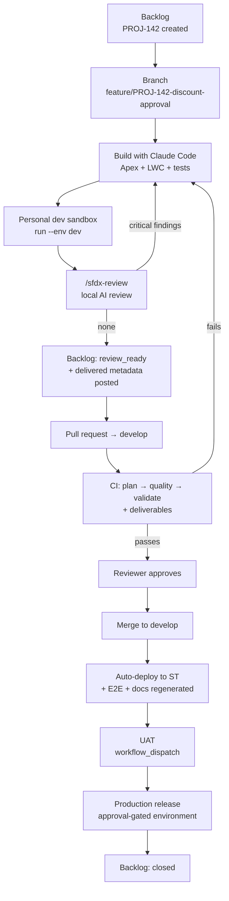

# Operations manual

The full flow from ticket to release, with the commands and output you actually
see. Examples use a fictional project `PROJ` (discount approval on Opportunity).

日本語版：[OPERATIONS_MANUAL.ja.md](OPERATIONS_MANUAL.ja.md)

---

## The flow



Ticket statuses come from `backlog_integration.status_mapping` in
`sfdx-pipeline.config.yml`.

---

## Roles

| Role            | Work                                                                                    | Tools                                      |
| --------------- | --------------------------------------------------------------------------------------- | ------------------------------------------ |
| Developer       | Take the ticket, build, verify in a dev sandbox, `/sfdx-review`, open the PR            | Claude Code, dev sandbox, Backlog MCP, git |
| Reviewer / lead | Check CI and the AI review, approve, merge to `develop`                                 | GitHub PR, Actions                         |
| DevOps          | Change config (add a sandbox, adjust a gate), maintain the knowledge base, run releases | `sfdx-pipeline.config.yml`, GitHub Secrets |

The dividing line: **anything the config can change, change in the config.** If
you need to edit the workflow YAML, a config option is missing — open an issue.

---

## One-time setup

```bash
cd my-sfdx-project
npx sfdx-devops-kit init .
npm install
```

Edit `sfdx-pipeline.config.yml` (org aliases, thresholds, Backlog project key),
then:

```bash
$ npx sfdx-devops-kit validate
config: sfdx-pipeline.config.yml
  ✔ valid — 4 environment(s)

Required GitHub Secrets:
  SF_DEV_AUTH_URL          → DevSandbox (sandbox)
  SF_ST_AUTH_URL           → STSandbox (sandbox)
  SF_UAT_AUTH_URL          → UATSandbox (sandbox)
  SF_PROD_AUTH_URL         → Production (production)
```

Register each secret:

```bash
sf org display --target-org STSandbox --verbose | grep "Sfdx Auth Url"
gh secret set SF_ST_AUTH_URL   # paste the value when prompted, do not put it in shell history
```

> An auth URL is a credential. It must never reach a commit, a ticket comment, a
> log or a generated document.

Claude Code and rtk-sf:

```bash
pip install "git+https://github.com/furuCRM-Inc/rtk-sf.git@v0.10.0"
claude mcp add rtk-sf -- python3 -m rtk_sf serve
python3 -m rtk_sf index
npx sfdx-devops-kit doctor
```

Register your Backlog MCP server too — the skills use it for ticket access.

For production, create a GitHub `Production` environment with required
reviewers. The generated `deploy` job declares `environment:`, so a release
cannot reach production without approval.

---

## Step 1 — Ticket

Create the ticket in Backlog. The key goes into the branch name, so note it
(e.g. `PROJ-142`).

```text
Title: Discount approval on Opportunity (over 30% requires approval)

Context:
  Discounts above 30% can currently be closed without approval.

Acceptance criteria:
  - A discount rate can be requested from the Opportunity page
  - Requests above 30% enter the approval process
  - 30% or below applies immediately
  - An Opportunity awaiting approval cannot move to Closed Won

Expected scope:
  Opportunity (fields), Apex controller, LWC, approval process
```

Assign yourself and set the status to `処理中` (in progress).

## Step 2 — Start

Branch naming: `feature/<TICKET-KEY>-<short-summary>`.

```bash
git switch develop && git pull
git switch -c feature/PROJ-142-discount-approval

$ npx sfdx-devops-kit ticket
branch: feature/PROJ-142-discount-approval
ticket: PROJ-142
```

`ticket: (unresolved)` means the branch name or `project_key` needs fixing.

Then ask Claude Code to survey the existing implementation. It reads through
rtk-sf's MCP tools (compressed specs, class skeletons) instead of whole files,
which keeps the survey cheap and the blast radius visible.

## Step 3 — Build

```text
Add Discount__c (Percent) and Discount_Status__c (Picklist) to Opportunity, and
create OpportunityDiscountController.requestDiscount(Id oppId, Decimal rate).
Over 30% goes to the approval process, 30% or below applies immediately.
Follow knowledge/sfdx/coding-rules.md. Include tests: happy path, the 30%
boundary, error paths, and bulk.
```

The rules the review enforces live in `knowledge/sfdx/coding-rules.md`. To change
what is enforced, edit that file — not the code.

```bash
npx sfdx-devops-kit run lint prettier
```

## Step 4 — Verify in your dev sandbox

```bash
$ npx sfdx-devops-kit run --env dev --dry-run    # prints commands, touches nothing
$ npx sfdx-devops-kit run --env dev --skip e2e_test
▶ code_analyzer: Salesforce Code Analyzer
  ✔ No violations at severity <= 3 (2 total finding(s))
▶ validate_deploy: Validation deploy to DevSandbox (dry run)
  ✔ Succeeded: 6 component(s); coverage 87%
▶ unit_test: Apex unit tests and coverage gate
  ✔ Coverage 87% meets the 75% threshold
▶ deploy: Deploy to DevSandbox
  ✔ Succeeded: 6 component(s); coverage 87%

✔ pipeline passed — 4/4 stage(s) passed, coverage 87%
```

Then exercise the feature in the org UI.

## Step 5 — Local AI review

```text
/sfdx-review
```

```text
Review — PROJ-142 (feature/PROJ-142-discount-approval)

critical: 0
major: 1
  - OpportunityDiscountController.cls:48
    Writing method has no CRUD/FLS enforcement. Use `update as user` or
    stripInaccessible (coding-rules.md §2)
minor: 1
  - OpportunityDiscountControllerTest.cls:72 — the exact 30% boundary is uncovered

Deliverables: 6 components (CustomField 2 / ApexClass 2 / LWC 1 / Flow 1)
Backlog: commented on PROJ-142. No critical findings, so the status moved to 処理済み.
```

The Backlog comment carries the findings, the delivered-metadata table **and the
pull request link** (resolved with `gh pr view`; before the PR exists it falls back
to a compare URL, labelled as such). Run the skill again after opening the PR when
you want the real PR URL recorded on the ticket.

With even one critical finding the status does not move — fix and re-run.

## Step 6 — Pull request and CI

```bash
git commit -am "feat(PROJ-142): add discount approval flow"
git push -u origin feature/PROJ-142-discount-approval
gh pr create --base develop --fill
```

Paste the deliverables into the PR body:

```bash
npx sfdx-devops-kit deliverables --base origin/develop --format md
```

| Job            | What it does                                             | Result          |
| -------------- | -------------------------------------------------------- | --------------- |
| `plan`         | Validates config, publishes the plan to the step summary | ✅              |
| `quality`      | ESLint / Prettier / Code Analyzer                        | ✅              |
| `validate`     | Dry-run deploy to ST + coverage gate                     | ✅ coverage 87% |
| `deliverables` | Attaches the component list and `package.xml`            | ✅ 6 components |

`deploy` never runs on a pull request, so a fork PR cannot deploy into an org.

A failure names the component and the org's own message:

```text
✖ validate_deploy: Deploy failed — 1 component error(s), e.g.
  ApexClass OpportunityDiscountController: Variable does not exist: Discount_Status__c
```

## Step 7 — Review and merge

1. All CI jobs green, coverage acceptable.
2. AI review findings resolved, or deferred with a stated reason.
3. The deliverables list matches the ticket's scope — no stray profile diffs.
4. The [review checklist](../knowledge/sfdx/review-checklist.md).

Approve and merge to `develop` (squash recommended).

## Step 8 — Automatic ST deployment

Pushing `develop` runs the pipeline including `deploy`:

```text
▶ deploy: Deploy to STSandbox            ✔ Succeeded: 6 component(s); coverage 87%
▶ integration_test: Integration tests    ✔ ok
▶ e2e_test: E2E tests                    ✔ ok
▶ documentation: system docs (rtk-sf)    ✔ ok
```

Artifacts: `playwright-report`, `system-documentation`. ST is shared — fix
forward rather than leaving it broken.

## Step 9 — UAT

```bash
gh workflow run sfdx-ci-cd.yml -f environment=uat
```

Business users run acceptance here. Defects go back to Step 2.

## Step 10 — Production release

Freeze the release contents:

```bash
npx sfdx-devops-kit deliverables --base origin/main --head origin/develop --format md
npx sfdx-devops-kit deliverables --base origin/main --head origin/develop \
  --format package-xml --out manifest/package.xml
```

Validate against production before releasing:

```bash
$ npx sfdx-devops-kit run validate_deploy unit_test --env prod
▶ validate_deploy: Validation deploy to Production (dry run)
  ✔ Succeeded: 18 component(s); coverage 81%
```

Open the release PR (`develop` → `main`), merge, then:

```bash
gh workflow run sfdx-ci-cd.yml -f environment=prod -f deploy=true
```

The job waits for an environment approver.

**Deletions** cannot ride in `package.xml` — the generated manifest says so in a
comment. Prepare `destructiveChanges.xml` and write the steps on the ticket.

Afterwards: run post-deploy steps (permission sets, data fixes, scheduled jobs),
verify the main journeys, close the ticket, and regenerate docs
(`python3 -m rtk_sf docs all --output-dir docs`).

### Rollback

| Situation                    | Action                                                                |
| ---------------------------- | --------------------------------------------------------------------- |
| Previous state is deployable | Validate then deploy the previous release tag                         |
| A new field is the problem   | Keep the field, disable the behavior through a custom-metadata switch |
| Something must be removed    | Prepare `destructiveChanges.xml` and check the impact first           |

Salesforce has no "undo deployment". Writing the rollback plan on the ticket
_before_ release is the real safety net.

---

## Exception flows

**Coverage below the threshold**

```text
✖ unit_test: Coverage 68% is below the 75% threshold
```

Add tests. Lowering the threshold is a team decision recorded in the config.

**Tests pass but the deploy fails**

```text
✖ validate_deploy: Deploy failed — org coverage requirement not met:
  選択された Apex Class のテストカバー率は 0% です。…
```

That is Salesforce's own requirement, reported in the org's language. Include
tests that cover the deployed classes, or revisit `test_level`.

**Analyzer engines will not start**

```text
✖ code_analyzer: Code Analyzer could not start 3 engine(s) (pmd, cpd, sfge),
  so the code was not analyzed: Could not locate Java v11.0.0+.
```

Install a JDK 11+. CI already does this via `setup-java`. Locally you can narrow
to `rule_selector: eslint`, which needs no Java.

**Hotfix**

```bash
git switch -c hotfix/PROJ-160-null-pointer main
npx sfdx-devops-kit run --env st --skip e2e_test
# /sfdx-review → PR to main → approve → release
```

Branch from `main` and merge back into both `main` and `develop`. Do not skip
gates; if you must, record why on the ticket.

---

## Routine

| Cadence       | Work                                                                        |
| ------------- | --------------------------------------------------------------------------- |
| Every release | Record deliverables on the ticket, regenerate docs                          |
| Weekly        | Review CI failure patterns, add lessons to `knowledge/sfdx/coding-rules.md` |
| Monthly       | Revisit thresholds, update dependencies (`npm audit`)                       |
| Quarterly     | Refresh secrets after sandbox refreshes, audit permissions                  |

When adding a rule, write down _why_. The AI review quotes that file as its
justification.

---

## Quick reference

| Goal                          | Command                                                                                      |
| ----------------------------- | -------------------------------------------------------------------------------------------- |
| Install                       | `npx sfdx-devops-kit init .`                                                                 |
| Validate config, list secrets | `npx sfdx-devops-kit validate`                                                               |
| See what will run             | `npx sfdx-devops-kit plan --env st`                                                          |
| Run locally                   | `npx sfdx-devops-kit run --env dev`                                                          |
| One or more stages            | `npx sfdx-devops-kit run code_analyzer unit_test`                                            |
| Show commands only            | `npx sfdx-devops-kit run --dry-run`                                                          |
| Deliverables                  | `npx sfdx-devops-kit deliverables --base origin/develop`                                     |
| Release manifest              | `… --base origin/main --head origin/develop --format package-xml --out manifest/package.xml` |
| Ticket key                    | `npx sfdx-devops-kit ticket`                                                                 |
| Environment check             | `npx sfdx-devops-kit doctor`                                                                 |
| AI review                     | `/sfdx-review`                                                                               |
| Record deliverables           | `/sfdx-deliverables`                                                                         |

| When                                       | Status     | Who                |
| ------------------------------------------ | ---------- | ------------------ |
| Starting work                              | `処理中`   | Developer (manual) |
| `/sfdx-review` with zero critical findings | `処理済み` | Skill (automatic)  |
| After release                              | `完了`     | Developer or lead  |

| Purpose | Branch                     | Merges into          |
| ------- | -------------------------- | -------------------- |
| Feature | `feature/PROJ-142-summary` | `develop`            |
| Bug fix | `bugfix/PROJ-151-summary`  | `develop`            |
| Hotfix  | `hotfix/PROJ-160-summary`  | `main` and `develop` |
| Release | `develop` → `main`         | `main`               |
